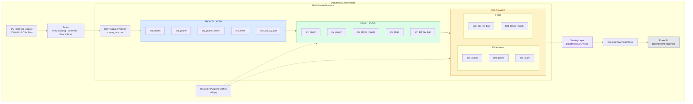

```mermaid
flowchart TB
    A["IPL Historical Dataset<br/>2008–2017 CSV Files"]

    subgraph DB["Databricks Environment"]
        S["Setup<br/>Unity Catalog · Schemas · Raw Volume"]

        A --> S
        S --> V["Unity Catalog Volume<br/>source_data.raw"]

        subgraph MED["Medallion Architecture"]
            direction TB

            subgraph B["BRONZE LAYER"]
                B1["brz_match"]
                B2["brz_player"]
                B3["brz_player_match"]
                B4["brz_team"]
                B5["brz_ball_by_ball"]
            end

            subgraph SI["SILVER LAYER"]
                SI1["slv_match"]
                SI2["slv_player"]
                SI3["slv_player_match"]
                SI4["slv_team"]
                SI5["slv_ball_by_ball"]
            end

            subgraph G["GOLD LAYER"]
                direction LR
                subgraph D["Dimensions"]
                    D1["dim_match"]
                    D2["dim_player"]
                    D3["dim_team"]
                end
                subgraph F["Facts"]
                    F1["fact_ball_by_ball"]
                    F2["fact_player_match"]
                end
            end

            V --> B
            B --> SI
            SI --> G
        end

        U["Reusable PySpark Utilities<br/>utils.py"]
        U -.-> SI
        U -.-> G

        G --> SV["Serving Layer<br/>Databricks SQL Views"]

        SV --> Q["Enriched Analytical Views"]

        Q --> P["Power BI<br/>Downstream Reporting"]
    end

    style B fill:#dbeafe,stroke:#2563eb,color:#172554
    style SI fill:#dcfce7,stroke:#16a34a,color:#14532d
    style G fill:#fef3c7,stroke:#d97706,color:#78350f
    style SV fill:#ede9fe,stroke:#7c3aed,color:#3b0764
    style P fill:#e5e7eb,stroke:#6b7280,color:#111827
```
